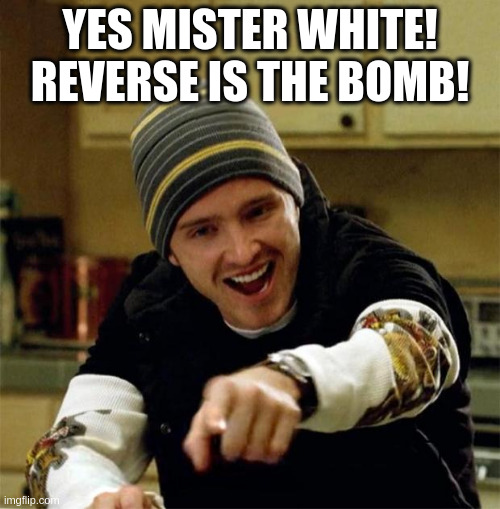

# FCSC 2024 Fifty Shades of White (Pinkman)

Vous incarnez désormais Jesse Pinkman. Vous êtes actuellement en froid avec Walter White et souhaitez lui faire un sale coup.

On vous demande d’écrire un keygen pour le binaire que Walter a conçu pour restreindre l’accès à ses données “professionnelles”. Le flag apparaîtra après 50 validations successives.

Fichiers :
- [fifty-shades-of-white](fifty-shades-of-white) (Application)
- [license-walter-white-junior.txt](license-walter-white-junior.txt)

Auteur : [Cryptanalyse](https://x.com/Cryptanalyse)

Origine : [Fifty Shades of White (Pinkman)](https://hackropole.fr/fr/challenges/reverse/fcsc2024-reverse-fifty-shades-of-white-2/)

-----------

## Connectez vous en WEBSSH
> http://localhost

#### tentez 
> nc fifty-shades-of-white.cyrhades.fr 4000

-----------

## Ou directement avec netcat
> nc localhost 4000

-----------

## Installation manuel
Vous n'utilisez pas l'application **les CTFs de Cyrhades** ? C'est dommage !
Mais voici comment installer ce CTF manuellement :

> git clone https://github.com/Hack-Oeil/fcsc2024-reverse-fifty-shades-of-white-2.git

> cd fcsc2024-reverse-fifty-shades-of-white-2

-----------

## Sur le site officiel hackropole.fr
> https://hackropole.fr/fr/challenges/reverse/fcsc2024-reverse-fifty-shades-of-white-2/